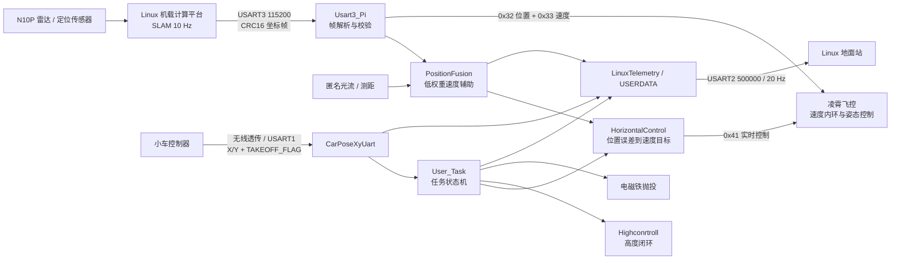

# ANO_LX_FC_NEW：2026 电赛 D 题无人机飞控工程

本仓库记录基于凌霄 STM32F407 飞控开发的 2026 年全国大学生电子设计竞赛 D 题“陆空协同无人机系统”**无人机端工程**。项目重点不是重新实现底层姿态飞控，而是在现有飞控能力之上完成外部定位接入、水平位置闭环、任务状态机、车机协同启动、地面站遥测和失效保护。

当前版本完成了固定航线飞行、抛投、返航以及基础车机通信，但尚未完成赛题要求的动态跟车、运动平台降落和二次起飞闭环。本文档将“官方赛题目标”和“当前代码能力”分开描述，避免把阶段性方案误认为完整赛题实现。

> 安全说明：这是竞赛原型代码，不应直接用于载人、商业运营或未经隔离的飞行环境。每次改动均应先经过静态检查、台架测试和受控场地低风险试飞。

## 赛题中的“空地协同”是什么

空地协同不是让无人机和小车各自跑完一段预设程序，而是让两个运动平台围绕同一任务实时配合：

- **任务协同**：小车从 A 点一键启动，同时通过无线链路触发无人机起飞，双方共享任务阶段。
- **状态协同**：小车向无人机提供位置、运动状态和启动信号；无人机向地面站报告位置、跟随、抛投、降落和起飞等状态。
- **运动协同**：无人机根据小车的实时运动更新目标点，使相对位置、航向和速度近似同步，而不是只飞向固定的 B、C、D 坐标。
- **物理协同**：无人机要在小车不停车的条件下完成物资投放，并在进阶任务中完成运动平台降落、稳定停留和再次起飞。
- **观测协同**：地面站实时显示车、机位置及任务状态，用于监视和留存证据；正式测试中不能依赖人工在线修改程序来完成任务。

因此，本题真正的难点是“运动目标感知与预测 + 相对运动控制 + 任务握手 + 异常降级”，而不只是无人机定点飞行或小车循迹。

## 2026 D 题关键要求

以下内容按[官方赛题 PDF](https://nuedc-sh.sjtu.edu.cn/storage/seiee/project/nuedc/article/2026/07/a39ece93641aa8983717fd509735a0a0.pdf)整理；场地约为 400 cm × 500 cm，小车从 A 点出发并沿黑线顺时针连续行驶一周，飞行器从 H 点起降。

| 任务 | 官方关键要求 | 分值 |
|---|---|---:|
| 起飞并形成跟随 | 小车启动后触发无人机在 H 点垂直起飞至 150±10 cm，稳定 3 s；在小车到达 B 点前形成跟随 | 15 |
| 运动中投放 | 跟随过程中自主投放 25±5 g 软质物体，并在小车到达 D 点前使物体稳定留在平台黑圈内 | 20 |
| 返航 | 投放后无人机以巡航高度返回 H 点并准确降落；小车继续行驶至 A 点停车 | 15 |
| 基础任务限时 | 从小车启动计时，上述过程不超过 90 s | 10 |
| 动态降落 | 小车 15 s 内到达 B 点；无人机搜索并跟随小车，在小车到达 D 点前平稳降落到运动平台 | 10 |
| 二次起飞 | 无人机在运动平台稳定停留 5 s 后再次起飞至 150±10 cm，返回 H 点降落；小车一周不超过 90 s | 10 |
| 地面站 | 图形化实时显示无人机和小车位置，并用文字显示跟随、投放、降落、起飞等状态 | 15 |

与控制实现直接相关的约束还包括：小车全程不得停车；飞行器最大轴距不超过 45 cm，螺旋桨须完全防护；测试开始后只能一键启动且不得人工干预；运动平台尺寸不超过 60 cm × 60 cm。

## 赛题目标与当前工程的对应关系

本队设计报告采用“车载激光雷达 + IMU + Cartographer”“机载 N10P 激光雷达 + SLAM”“凌霄飞控外部位置闭环”和无线串口协同方案。报告与当前源码反映的完成度如下：

| 赛题能力 | 当前工程状态 | 结论 |
|---|---|---|
| 小车启动触发无人机任务 | USART1 V2.1 帧提供 `TAKEOFF_FLAG`，以新的 0→1 边沿触发一次任务 | 已实现基础触发 |
| 150±10 cm 起飞并稳定 3 s | 当前任务高度为 100 cm，具备高度稳定判定 | 部分实现，参数不符合赛题值 |
| 在 B 点前形成真实跟随 | 当前无人机按 B、上半圆、C、D 固定航点飞行；小车 X/Y 只用于遥测，未进入跟随控制 | 未形成动态闭环 |
| 在 D 点前向运动平台投放 | 当前到达固定 D 点后释放电磁铁，没有以车机相对误差作为投放条件 | 仅完成固定点抛投 |
| 返回 H 点准确降落 | 当前返航目标为绝对坐标 `(0, 0)`，只有当 SLAM 地图原点与 H 点严格重合时才等价 | 有条件实现 |
| 运动平台降落、停留 5 s、二次起飞 | 当前任务状态机未包含相关状态和控制流程 | 未实现 |
| 地面站显示车、机位置和任务状态 | 无人机端已有 USART2 遥测帧及 USERDATA 诊断；完整图形界面属于配套地面站工程 | 已有通信基础，需联调取证 |

这里的“已实现”表示可以从源码和设计报告确认相应逻辑存在，不等同于已经通过全部实物测试。

## 项目亮点

- 通过 USART3 接收 Linux 机载计算平台输出的 SLAM 绝对坐标，完成长度、CRC 和字节序校验。
- 以 SLAM 为绝对位置主源，以光流速度作低权重短时辅助，运行 50 Hz 水平位置外环。
- 使用小车 `TAKEOFF_FLAG` 触发一次任务，但将“小车链路在线”“小车坐标有效”“任务启动许可”作为三个独立状态处理。
- 实现起飞、固定航点、抛投、返航和降落状态机，并设置定位超时、航点超时、总任务超时和地理围栏保护。
- 通过匿名上位机 USERDATA 和 Linux 地面站遥测暴露位置、目标、任务步骤、链路状态和安全状态。
- 保留遥控器安全使能和人工解锁权限；程序不会主动执行解锁。

## 系统架构

更完整的数据所有权、坐标系和更新频率说明见 [系统架构](docs/architecture.md)。

## 当前固件已实现流程（非完整赛题流程）

1. CH6 进入任务允许档，等待小车 V2.1 帧的 `TAKEOFF_FLAG` 从 0 变为 1。
2. 等待 SLAM 连续稳定并记录任务原点，切换至程控模式。
3. 等待操作者通过遥控器解锁；解锁后延时 2 秒。
4. 起飞至 100 cm，并在高度容差内连续稳定 3 秒。
5. 依次飞向 B、上半圆采样点、C 和 D，单航点 X/Y 容差为 ±13 cm。
6. 到达 D 后释放电磁铁，保持高度并返回绝对坐标 `(0, 0)`。
7. 在返航目标 X/Y 各 ±5 cm 内连续稳定 3 秒后执行一键降落。

状态、转换条件和异常路径见 [任务状态机](docs/mission-state-machine.md)。

## 从固定航线走向完整空地协同

1. **统一坐标与时间基准**：完成车体坐标、无人机 SLAM 坐标和场地坐标的外参标定，并给车机数据增加时间戳或帧序号，避免用过期位置追踪运动目标。
2. **扩展协同协议**：在当前 X/Y 和 `TAKEOFF_FLAG` 之外传输小车航向、速度、任务阶段与故障状态；关键阶段采用命令—应答握手，避免只依赖一次脉冲。
3. **增加相对跟随控制**：由小车位置、速度和航向生成无人机实时目标点，设置期望相对偏置；数据超时或预测误差过大时退出跟随并进入安全策略。
4. **建立投放判据**：同时检查车机相对位置、相对速度、平台可达区域和 D 点前的剩余窗口，满足连续稳定条件后才释放电磁铁。
5. **分阶段实现动态起降**：先完成静止平台识别和降落，再做低速直线运动平台，最后加入轨迹预测、渐进下降、接触确认、5 s 停留和二次起飞状态。
6. **补齐地面站证据链**：同步记录车机轨迹、链路新鲜度、当前任务状态、故障原因和关键事件时间，便于复盘 15 s、3 s、5 s、90 s 等硬指标。

## 安全设计

| 风险 | 当前防护 |
|---|---|
| SLAM 未初始化 | 位置需连续稳定 3 秒后才可使用 |
| SLAM 单帧跳变 | 初始化和飞行期间限制单帧最大跳变为 20 cm |
| SLAM 数据中断 | 300 ms 无更新时水平控制锁存故障并进入降落流程 |
| 航点无法到达 | 单航点 20 s、全航段 120 s 超时 |
| 返航无法完成 | 返航 30 s 超时 |
| 飞出任务区域 | 相对任务原点的矩形地理围栏 |
| 遥控器失控 | 重置任务并撤销再次启动资格 |
| 重复启动 | `TAKEOFF_FLAG` 必须先回到 0，之后新的 0→1 才能再次触发 |
| 意外解锁 | 解锁权仅属于遥控器，任务代码不发送解锁命令 |

这些保护需要通过故障注入得到证据，不能只依赖源码检查。测试项目和证据格式见 [验证与测试计划](docs/test-plan.md)。

## 通信接口

| 链路 | 参数 | 用途 |
|---|---|---|
| USART3 | 115200 bit/s，10 Hz 上游坐标 | 接收 SLAM X/Y，CRC16-CCITT-FALSE |
| USART1 | 115200 bit/s，20 Hz | 接收小车 X/Y 和一次性任务启动标志 |
| USART2 | 500000 bit/s，20 Hz | 向 Linux 地面站发送 22 字节状态帧 |
| 匿名上位机 USERDATA | 随上位机链路 | 集成阶段显示位置、目标、任务和有效性标志 |

帧格式、大小端和超时定义见 [通信协议索引](docs/protocols.md)。

## 关键代码

| 文件 | 责任 |
|---|---|
| `FcSrc/User_Task.c` | 自动任务状态机、安全门和异常降落入口 |
| `FcSrc/HorizontalControl.c` | SLAM 水平位置外环和有效性判断 |
| `FcSrc/PositionFusion.c` | SLAM 主导的水平位置融合 |
| `FcSrc/Highconrtroll.c` | 激光高度闭环 |
| `FcSrc/LX_FC_EXT_Sensor.c` | 向凌霄飞控提交外部位置和派生速度 |
| `UserDriver/Usart3_Pi.c` | SLAM 串口帧解析 |
| `UserDriver/CarPoseXyUart.c` | 小车帧解析、CRC、链路/坐标有效性和启动标志 |
| `UserDriver/LinuxTelemetry.c` | Linux 地面站状态遥测 |
| `UserDriver/UserDataTransfer.c` | 匿名上位机集成诊断 |

## 构建与验证边界

Keil 工程位于 `ProjectSTM32F407/ANO_LX_STM32F407.uvprojx`。建议每次准备实飞版本时保存以下证据：

1. Keil 完整构建日志，要求 0 error；warning 必须逐项解释。
2. SLAM、小车和地面站三条串口链路的完整十六进制帧抓取。
3. 静态台架故障注入记录，包括断线、坏 CRC、超时和坐标跳变。
4. 受控试飞日志和视频，标注固件提交、参数、场地坐标系和测试结果。

本次文档整理只描述源码中可以确认的行为，不把“编译通过”表述为“硬件验证通过”，也不把一次比赛飞行视为所有故障路径均已验证。

## 公开发布前

仓库当前未声明开源许可证，因此默认不授予复制、修改或分发权。凌霄飞控基础代码、厂商资料、比赛报告、参赛人员信息和现场素材还应分别核对版权与隐私后，再决定是否公开。详细检查项见 [公开发布检查清单](docs/public-release-checklist.md)。

## 文档导航

- [系统架构与数据所有权](docs/architecture.md)
- [任务状态机](docs/mission-state-machine.md)
- [通信协议索引](docs/protocols.md)
- [验证与测试计划](docs/test-plan.md)
- [公开发布检查清单](docs/public-release-checklist.md)
