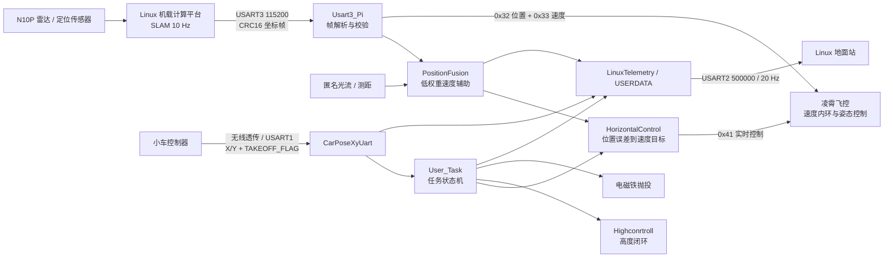

# ANO_LX_FC_NEW：2026 电赛 D 题无人机飞控工程

本仓库记录基于凌霄 STM32F407 飞控完成的“陆空协同无人机系统”无人机端实现。项目重点不是重新实现底层姿态飞控，而是在现有飞控能力之上完成外部定位接入、水平位置闭环、任务状态机、车机协同启动、地面站遥测和失效保护。

> 安全说明：这是竞赛原型代码，不应直接用于载人、商业运营或未经隔离的飞行环境。每次改动均应先经过静态检查、台架测试和受控场地低风险试飞。

## 项目亮点

- 通过 USART3 接收 Linux 机载计算平台输出的 SLAM 绝对坐标，完成长度、CRC 和字节序校验。
- 以 SLAM 为绝对位置主源，以光流速度作低权重短时辅助，运行 50 Hz 水平位置外环。
- 使用小车 `TAKEOFF_FLAG` 触发一次任务，但将“小车链路在线”“小车坐标有效”“任务启动许可”作为三个独立状态处理。
- 实现起飞、固定航点、抛投、返航和降落状态机，并设置定位超时、航点超时、总任务超时和地理围栏保护。
- 通过匿名上位机 USERDATA 和 Linux 地面站遥测暴露位置、目标、任务步骤、链路状态和安全状态。
- 保留遥控器安全使能和人工解锁权限；程序不会主动执行解锁。

## 系统架构

更完整的数据所有权、坐标系和更新频率说明见 [系统架构](docs/architecture.md)。

## 当前任务流程

1. CH6 进入任务允许档，等待小车 V2.1 帧的 `TAKEOFF_FLAG` 从 0 变为 1。
2. 等待 SLAM 连续稳定并记录任务原点，切换至程控模式。
3. 等待操作者通过遥控器解锁；解锁后延时 2 秒。
4. 起飞至 100 cm，并在高度容差内连续稳定 3 秒。
5. 依次飞向 B、上半圆采样点、C 和 D，单航点 X/Y 容差为 ±13 cm。
6. 到达 D 后释放电磁铁，保持高度并返回绝对坐标 `(0, 0)`。
7. 在返航目标 X/Y 各 ±5 cm 内连续稳定 3 秒后执行一键降落。

状态、转换条件和异常路径见 [任务状态机](docs/mission-state-machine.md)。

## 安全设计

| 风险 | 当前防护 |
|---|---|
| SLAM 未初始化 | 位置需连续稳定 3 秒后才可使用 |
| SLAM 单帧跳变 | 初始化和飞行期间限制单帧最大跳变为 20 cm |
| SLAM 数据中断 | 300 ms 无更新时水平控制锁存故障并进入降落流程 |
| 航点无法到达 | 单航点 20 s、全航段 120 s 超时 |
| 返航无法完成 | 返航 30 s 超时 |
| 飞出任务区域 | 相对任务原点的矩形地理围栏 |
| 遥控器失控 | 重置任务并撤销再次启动资格 |
| 重复启动 | `TAKEOFF_FLAG` 必须先回到 0，之后新的 0→1 才能再次触发 |
| 意外解锁 | 解锁权仅属于遥控器，任务代码不发送解锁命令 |

这些保护需要通过故障注入得到证据，不能只依赖源码检查。测试项目和证据格式见 [验证与测试计划](docs/test-plan.md)。

## 通信接口

| 链路 | 参数 | 用途 |
|---|---|---|
| USART3 | 115200 bit/s，10 Hz 上游坐标 | 接收 SLAM X/Y，CRC16-CCITT-FALSE |
| USART1 | 115200 bit/s，20 Hz | 接收小车 X/Y 和一次性任务启动标志 |
| USART2 | 500000 bit/s，20 Hz | 向 Linux 地面站发送 22 字节状态帧 |
| 匿名上位机 USERDATA | 随上位机链路 | 集成阶段显示位置、目标、任务和有效性标志 |

帧格式、大小端和超时定义见 [通信协议索引](docs/protocols.md)。

## 关键代码

| 文件 | 责任 |
|---|---|
| `FcSrc/User_Task.c` | 自动任务状态机、安全门和异常降落入口 |
| `FcSrc/HorizontalControl.c` | SLAM 水平位置外环和有效性判断 |
| `FcSrc/PositionFusion.c` | SLAM 主导的水平位置融合 |
| `FcSrc/Highconrtroll.c` | 激光高度闭环 |
| `FcSrc/LX_FC_EXT_Sensor.c` | 向凌霄飞控提交外部位置和派生速度 |
| `UserDriver/Usart3_Pi.c` | SLAM 串口帧解析 |
| `UserDriver/CarPoseXyUart.c` | 小车帧解析、CRC、链路/坐标有效性和启动标志 |
| `UserDriver/LinuxTelemetry.c` | Linux 地面站状态遥测 |
| `UserDriver/UserDataTransfer.c` | 匿名上位机集成诊断 |

## 构建与验证边界

Keil 工程位于 `ProjectSTM32F407/ANO_LX_STM32F407.uvprojx`。建议每次准备实飞版本时保存以下证据：

1. Keil 完整构建日志，要求 0 error；warning 必须逐项解释。
2. SLAM、小车和地面站三条串口链路的完整十六进制帧抓取。
3. 静态台架故障注入记录，包括断线、坏 CRC、超时和坐标跳变。
4. 受控试飞日志和视频，标注固件提交、参数、场地坐标系和测试结果。

本次文档整理只描述源码中可以确认的行为，不把“编译通过”表述为“硬件验证通过”，也不把一次比赛飞行视为所有故障路径均已验证。

## 公开发布前

仓库当前未声明开源许可证，因此默认不授予复制、修改或分发权。凌霄飞控基础代码、厂商资料、比赛报告、参赛人员信息和现场素材还应分别核对版权与隐私后，再决定是否公开。详细检查项见 [公开发布检查清单](docs/public-release-checklist.md)。

## 文档导航

- [系统架构与数据所有权](docs/architecture.md)
- [任务状态机](docs/mission-state-machine.md)
- [通信协议索引](docs/protocols.md)
- [验证与测试计划](docs/test-plan.md)
- [公开发布检查清单](docs/public-release-checklist.md)
