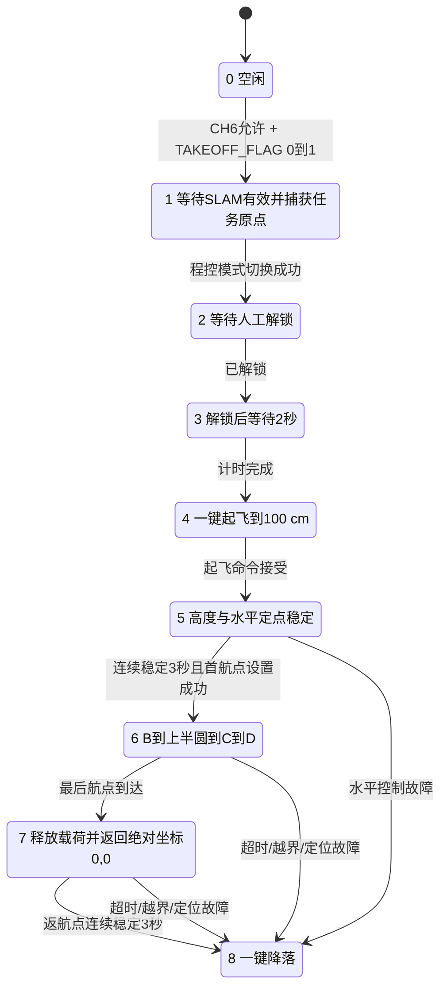

# 自动任务状态机

状态机入口位于 `FcSrc/User_Task.c`，周期为 20 ms。

## 状态定义

| 状态 | 行为 | 正常退出条件 |
|---:|---|---|
| 0 | 空闲，等待一次新的启动边沿 | CH6 任务允许、`TAKEOFF_FLAG=1` 且启动已重新武装 |
| 1 | 等待有效 SLAM，切换程控模式，捕获位置目标和任务原点 | SLAM 有效且模式切换成功 |
| 2 | 等待操作者解锁 | `unlock_sta != 0` |
| 3 | 解锁后等待 | 2 s 到期 |
| 4 | 请求一键起飞至 100 cm | 起飞接口接受请求 |
| 5 | 维持 100 cm 和起飞点水平位置 | 高度进入 ±5 cm 且连续保持 3 s |
| 6 | 依次执行 8 个水平航点 | 每点进入 X/Y 各 ±13 cm；最后一点到达 |
| 7 | 关闭电磁铁并返回 `(0,0)` | X/Y 各 ±5 cm 内连续稳定 3 s |
| 8 | 停止水平输出、复位高度环并发送一次降落命令 | 由凌霄基础飞控完成降落 |
| 10 | CH6 非任务档下捕获当前位置和激光高度进行安全悬停 | CH6 档位改变 |

## 启动门

启动必须同时满足：

1. 遥控器未处于失控保护；
2. CH6 在任务允许区间；
3. 收到新鲜、结构和 CRC 正确的 V2.1 小车帧；
4. `TAKEOFF_FLAG` 已经历新的 0→1；
5. SLAM 完成连续稳定资格确认；
6. 操作者随后通过遥控器解锁。

其中链路在线、坐标有效和起飞标志是不同概念。小车即使发送坐标无效哨兵，仍可在合法 V2.1 帧中发送启动标志；当前无人机航线不消费小车坐标。

## 异常路径

| 触发条件 | 当前响应 | 建议证据 |
|---|---|---|
| RC fail-safe | 重置状态机，撤销启动重新武装 | 遥控器断开前后 TASK_STEP 与输出抓取 |
| CH6 离开任务允许档 | 重置自动任务或进入位置/高度悬停 | CH6、模式、目标和实际位置曲线 |
| SLAM 超过 300 ms 未更新 | 水平控制锁存故障，任务进入降落 | 断开 USART3 RX 并记录时间轴 |
| SLAM 单帧跳变超过 20 cm | 重新进入资格确认/撤销有效性 | 注入跳变帧并观察 USERDATA4 |
| 单航点超过 20 s | 进入降落 | 固定位置输入模拟无法到达 |
| 全航段超过 120 s | 进入降落 | 缩短测试常量或仿真计时 |
| 返航超过 30 s | 进入降落 | 固定返航误差并记录 TASK_STEP |
| 超出地理围栏 | 进入降落 | 台架注入边界内外坐标 |

“进入降落”表示任务层调用一键降落接口；仍需在台架和受控试飞中验证基础飞控在定位丢失、测距异常或模式切换失败时的实际行为。
